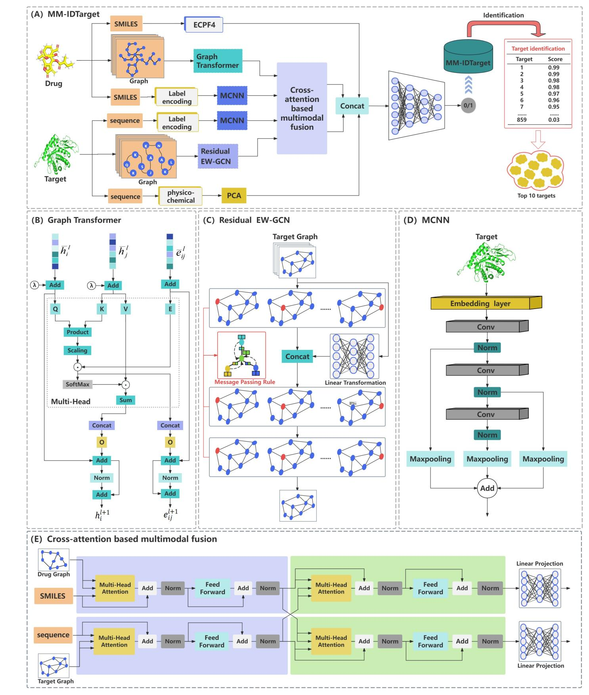
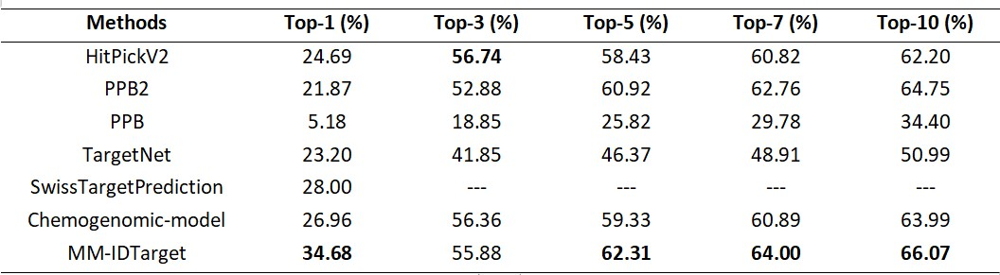
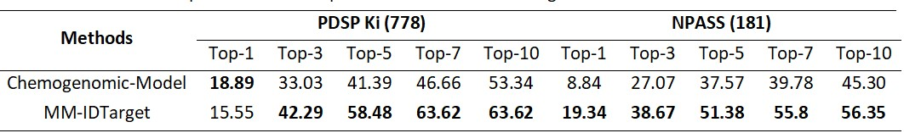
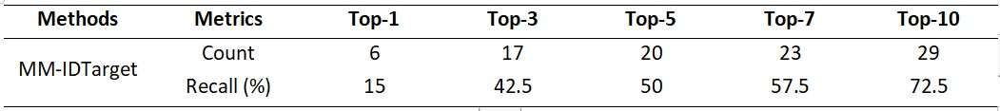

# MM-IDTarget: a novel deep learning framework for identifying targets using cross-attention based multimodal fusion strategy

## 🚀 Introduction (MM-IDTarget)

In this study, we proposed a novel **deep learning framework** called MM-IDTarget using **multimodal fusion strategy based on cross-attention mechanism** for identifying targets. Our approach combined multiple **cutting-edge deep learning techniques**, including **Graph Transformer**, **Residual EW-GCN**, and **MCNN**, to extract multimodal features from the sequences and structures of drugs and targets. Next, we employed **intra and inter cross-attention mechanisms** to effectively fuse the extracted multimodal features. Finally, we integrated the **physicochemical modal features of drugs and targets** to predict drug-target interactions by fully connected network. MM-IDTarget comprised five main modules: **multimodal feature extraction of drug**, **multimodal feature extraction of target**, **multimodal feature fusion**, **drug-target interactions prediction**, and **targets identification**.

We focus on using end-to-end methods for identifying targets, our overall framework can be shown in the following figure.



## 📑 Results

### Downloads
- All the data involved in MM IDTarget can be downloaded from (link：https://pan.baidu.com/s/1xqsIDXsb0CFIeyyXyzOPag Extracted code：ddv7)
- Protein_pdb: The pdb and mutant files in MM-IDTarget formation can be downloaded from the data file (link：https://pan.baidu.com/s/1xqsIDXsb0CFIeyyXyzOPag Extracted code：ddv7)
- **PDSPKi (778)** and **NPASS (181)** dataset can be found in (link：https://pan.baidu.com/s/1xqsIDXsb0CFIeyyXyzOPag  Extracted code：ddv7)

### Paper Results

We tested **MM-IDTarget** and compared it to **current state-of-the-art methods** for identifying targets.



To further evaluate **the generalization ability** of MM-IDTarget, we compared it with the **best performing target identification method** on **two additional test**: **PDSP Ki (778)** and **NPASS (181)**.



In our study, we aimed to assess the practical utility of **MM-IDTarget** beyond its performance on **generalized datasets**. Specifically, we evaluated its capability for target identification using a **dataset derived from approved drugs**. To construct our case study dataset, we retrieved drugs corresponding to these **859 targets** from **the Therapeutic Target Database (TTD)**. To ensure the dataset's integrity and avoid redundancy, we **excluded drug-target pairs** already present in our **benchmark dataset**. Subsequently, we randomly selected **40 samples** from the remaining pairs to form our **case study dataset**.



## 🛫 Requirement

### Conda Enviroment

Please make sure you have installed **[Anaconda3](https://www.anaconda.com/download)** 

**If you already have a enviroment.**

We recommend that the `torch_geometric` should been updated to 2.3.1 or higher.

**If you don't have a enviroment.**

```shell
conda env create -f environment.yaml
conda activate protssn
pip install torch_scatter torch_sparse torch_cluster -f https://data.pyg.org/whl/torch-2.3.1+cu121.html
```

### Hardware

- For direct use of **model**, we recommend at least **10G** of memory, such as RTX 3080
- For **retraining** a MM-IDTarget, we recommend that the larger the memory. We recommend a **24GB** RTX 4090 or better.


## ✏️ 1. Use our pre-trained model
In this section, we provide four target identification datasets: **swiss_validation_datasets (1061)**, **PDSPKi (778)**, **NPASS (181)**, and **Case (40)**, you can run our **target identification model** and obtain **a pair of target pairs** or **the entire dataset target pair** results by executing the following commands.

```bash
# Run the following command. a pair of target pairs
python test_Recall.py

# Run the following command. the entire dataset target pair
python Recall_Top_cnn.py
```

## ✏️ Pre-train From Scratch

### 1.Download Pre-train Dataset or Work with datasets

We use (https://github.com/dldxzx/MM-IDTarget/data/target_drug.csv) for pre-training, you can **refined the dataset**.(1) Utilizing 859 targets as the basis, we partitioned 153281 drug-target pairs into **859 sub-datasets**.(2) Employing a **similarity threshold of 0.3**, we clustered the drugs within **each sub-dataset**, resulting in the subdivision of each sub-dataset into **multiple drug clusters**.(3) Within each drug cluster, if the number of **positive (negative)** samples was 1, we retained that sample; if the number exceeded 1, we selected 25% of the **positive (negative)** samples **(rounded up)** and preserved them.(4) Subsequently, to **assess the performance of the model**, we further divided the extracted samples from each drug cluster into **training and testing sets**: if the number of **positive (negative)** samples in the cluster was 2 or less, all **positive (negative)** samples were utilized for the **training set**; if the number exceeded 2 but was 10 or less, 10% of the samples **(rounded up)** were randomly assigned to the **testing set**, with the remainder allocated to the **training set**; if the number exceeded 10, 8% of the samples **(rounded up)** were randomly selected for the **testing set**, with the remaining **positive (negative)** samples assigned to the **training set**. Following these partitioning procedures, the sample sizes of the **training and testing sets** approached a ratio of **9:1**. Specifically, the training set comprised **42394 samples (positive samples: 21243, negative samples: 21151)**, while the testing set contained **4853 samples (positive samples: 2523, negative samples: 2330)**, ensuring the balance of **positive and negative** samples in the benchmark dataset.


### 2.Build Target and Drug Graph and save multi-signature PT files

You can build a **target graph and a drug graph** first, and then we can **extract the node and edge features**, respectively. Then, the **sequence features** and **physicochemical properties** are saved to the **PT file** for subsequent calling.

```bash
# The Target Graph is built from data related to the biological targets (e.g., proteins, enzymes). 
# The nodes in this graph represent biological targets, and the edges represent relationships between them.
# The command python TargetGraph.py will generate the target graph and save it as a PT file.
python TargetGraph.py

# The Drug Graph is created using data related to drug compounds. 
# The nodes in this graph represent individual drugs, and the edges capture the relationships or interactions between drugs or their components.
# The command python DrugGraph.py will generate the drug graph and save it as a PT file.
python DrugGraph.py

# Once the target and drug graphs are built and saved in PT files, the next step is to generate the dataset used for model training. 
# The dataset combines the training set and test set data, stored in PT files, for easy loading during model training and evaluation.
# The command python dataset.py will process these PT files and prepare the dataset for subsequent use.
python dataset.py
```

### 3.Start Training

When all the **data is ready**, you can **train your own model** by running the following command.

```bash
# Once the dataset is ready, you can begin training your machine learning model. 
# This involves using the pre-processed data (target and drug graphs, sequence features, physicochemical properties) to train a model 
# that can perform tasks like predicting interactions or identifying targets for drugs.
# The training script (python training.py) will handle the entire process of model initialization, training, and saving the trained model.
python training.py
```

### 4.Target identification

You can run the following command on the four object **recognition datasets(swiss_validation_datasets, PDSPKi, NPASS, and Case)** to obtain the results of **one pair of objects** or **the entire dataset** of two object recognition datasets.

```bash
# If you are interested in evaluating how well your model performs on a specific pair of targets, you can use the command python test_Recall.py. 
# This command will test the model's ability to identify interactions between a single pair of targets.
python test_Recall.py

# To evaluate the model across the entire dataset, which includes multiple target pairs from the recognition datasets, you can use the command 
# python Recall_Top_cnn.py. This command will run the model on all the targets in the datasets and provide results for all interactions in the 
# form of recall metrics, which measure how well the model identifies relevant target pairs.
python Recall_Top_cnn.py
```

## 🙌 Contact

If you have questions or suggestions, please contact: yili@dali.edu.cn, and oriental-cds@163.com.
